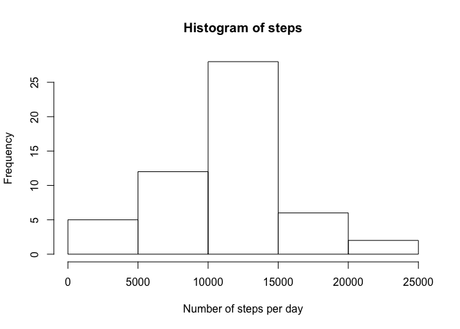
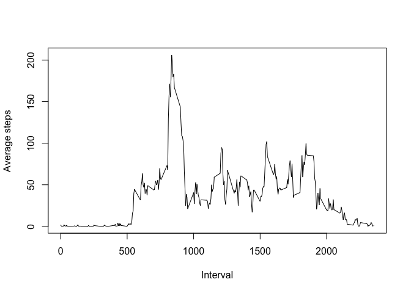
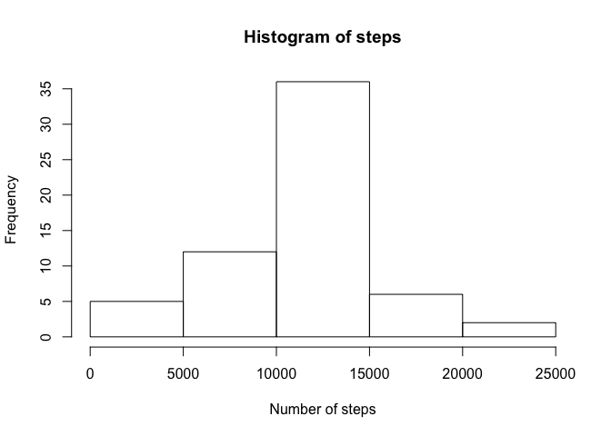

# Reproducible research assig 1
Matt Henn  
March 13, 2015  
## Loading/preprocessing data
The first step in this analysis is to download the data and get it in its raw form into R Studio. 


```r
setwd("/Users/Matt/RepData_PeerAssessment1")
unzip("activity.zip")
dat <- read.csv("activity.csv")
```

## First bit of analysis
The first deliverables of the assignment are: 

  * calculate the total number of steps taken per day
  * create a histogram of total steps per day
  * calculate the mean and median steps taken per day. 

However, first we need to get the dates column to be recognized as dates. This is easily accomplished with the lubridate package (install it if you don't already have it).


```r
library(lubridate)
dat$date <- ymd(dat$date)
class(dat$date)
```

```
## [1] "POSIXct" "POSIXt"
```
Now the total steps taken per day, stored in the data frame tspd. 


```r
tspd <- aggregate(steps ~ cut(date, "day"), dat, sum)
```

The histogram of total steps per day. 


```r
hist(tspd$steps, 
     xlab = "Number of steps per day",
     main = "Histogram of steps")
```

 

Mean and median steps per day. 


```r
av <- mean(tspd$steps)
med <- median(tspd$steps)
print(av)
```

```
## [1] 10766.19
```

```r
print(med)
```

```
## [1] 10765
```

## Daily Pattern from data

The next deliverable is to establish some sort of daily pattern, and determine on average, which 5 minute interval has the maximum amount of steps in it. 


```r
dailyav <- as.data.frame(tapply(dat$steps, dat$interval, mean, na.rm = TRUE))
dailyav$interval <- row.names(dailyav)


plot(dailyav$interval, dailyav[,1], 
     type = "l",
     xlab = "Interval",
     ylab = "Average steps")
```

 

```r
ms <- which.max(dailyav[,1])
maxavsteps <- dailyav[ms,2]
print(maxavsteps)
```

```
## [1] "835"
```

As shown above, the maximum average steps occur at the 0835 interval. Perhaps this is the morning commute.  

## Imputing missing values

*Calculate and report the number of missing values in the dataset.*


```r
length(which(is.na(dat$steps)))
```

```
## [1] 2304
```

```r
length(which(is.na(dat$date)))
```

```
## [1] 0
```

```r
length(which(is.na(dat$interval)))
```

```
## [1] 0
```

Looks like we are missing lots of values, though only for the 'steps' column. Lets fill each of these rows with the median steps taken during that interval. We will create a separate data frame in which to do this first though. 


```r
dat1 <- dat
dat1$steps[is.na(dat1$steps)] <- tapply(dat1$steps, dat1$interval, mean, na.rm = TRUE)
length(which(is.na(dat1$steps)))
```

```
## [1] 0
```

Our goal has been accomplished in dat1. Let's see if this changed the mean and median total steps taken per day. 


```r
tspd1 <- aggregate(steps ~ cut(date, "day"), dat1, sum)
hist(tspd1$steps, 
     xlab = "Number of steps",
     main = "Histogram of steps")
```

 

```r
av1 <- mean(tspd1$steps)
med1 <- median(tspd1$steps)
print(av1)
```

```
## [1] 10766.19
```

```r
print(med1)
```

```
## [1] 10766.19
```

Unsurprisingly, it did not. We originally ignored the missing data, and later filled it in with the average values of the non missing data. It makes sense that the average is not changed, because we didn't add any values that weren't average. The only difference is that there are now 61 days in the data set, instead of 53. 

## Differences between weekdays and weekends

To establish which days in the dataset are weekdays and which are weekends we will use a combination of the weekdays() and ifelse() functions. 


```r
dat1$day <- weekdays(dat1$date)
dat1$tday <- ifelse((dat1$day == "Saturday"), dat1$tday <- "weekend", 
                    (ifelse((dat1$day == "Sunday"), dat1$tday <- "weekend", dat1$tday <- "weekday")))
```

The next step is to figure out how the average number of steps varies from weekdays to weekends, and display the comparison in 2 time-series plots. 


```r
dat2 <- subset(dat1, dat1$tday == "weekday")
weekdayav <- as.data.frame(tapply(dat2$steps, dat2$interval, mean, na.rm = TRUE))

dat3 <- subset(dat1, dat1$tday == "weekend")
weekendav <- as.data.frame(tapply(dat3$steps, dat3$interval, mean, na.rm = TRUE))

par(mfrow = c(2,1))
plot(row.names(weekdayav), weekdayav[,1],
     type = "l",
     ylab = "Steps",
     xlab = "5 minute interval",
     main = "Weekdays")
plot(row.names(weekendav), weekendav[,1],
     type = "l",
     ylab = "Steps",
     xlab = "5 minute interval",
     main = "Weekends")
```

 


Looks like there is a difference between the two day types - indicating this person works a regular Monday to Friday job, and is more active on the weekends. 
